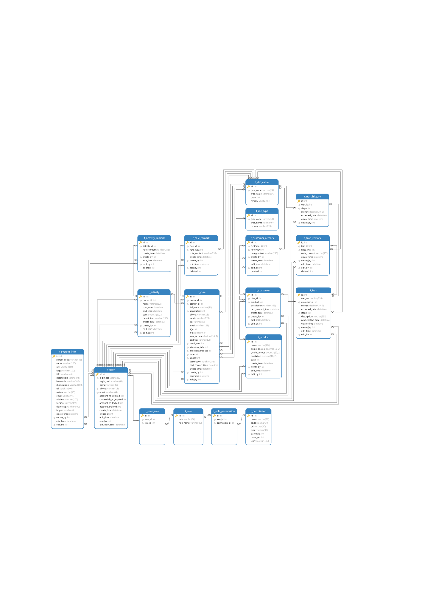

# CRM 项目实战练习

## 简介

本项目基于 https://www.bilibili.com/video/BV1Fi4y1W7NZ/ 视频中提供的资源以及思路进行重做以及部分增强

项目采用前后端分离技术
- 前端主要使用 Vue 框架进行开发
- 后端使用 Spring Boot + MyBatis 完成主要功能的开发
- 使用 Spring Security 进行项目的权限控制
- 数据库使用 MySql + Redis

## 数据库ER图



## 前端项目

采用 Vue 作为主要技术开发

目录结构

```
|- crm-front           -- 项目根目录
|  |- node_modules     -- js 依赖包
|  |- public           -- 公共静态资源
|  |- src              -- 源码文件
|  |- index.html       -- 项目首页，访问入口
|  |- package.json     -- 项目依赖库配置，包括启动、构建命令
|  |- vite.config.js   -- vite 配置文件
```