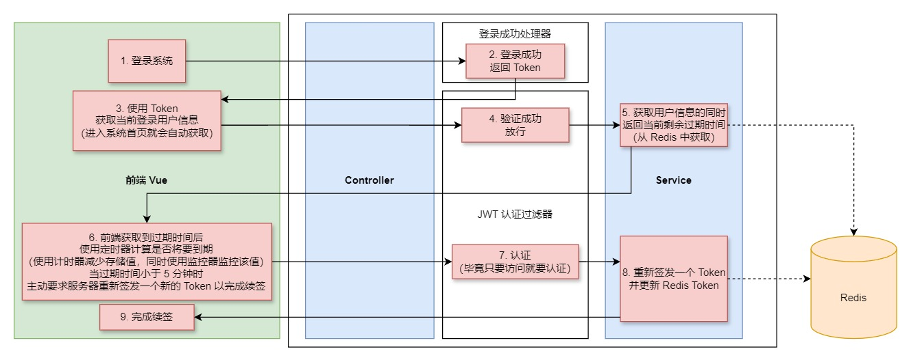
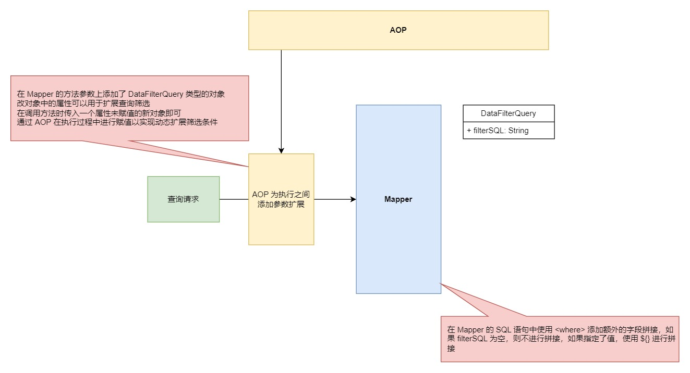

# CRM 项目实战练习

## 简介

本项目基于 https://www.bilibili.com/video/BV1Fi4y1W7NZ/ 视频中提供的资源以及思路进行重做以及部分增强

项目采用前后端分离技术
- 前端主要使用 Vue 框架进行开发
- 后端使用 Spring Boot + MyBatis 完成主要功能的开发
- 使用 Spring Security 进行项目的权限控制
- 数据库使用 MySql + Redis

## 目前阶段

还在制作当中

### TODO List

- 实现全部业务
- 完善前端页面展示，添加搜索条件查询
- Redis 缓存相关，打算采用 AOP 进行优化改进
- 压缩共用代码
- 优化部分类结构

## 数据库ER图


## 前端项目

采用 Vue 作为主要技术开发

目录结构

```
|- crm-front                     -- 项目根目录
   |- node_modules               -- js 依赖包
   |- public                     -- 公共静态资源
   |- src                        -- 源码文件
   |  |- assets                  -- 页面资源
   |  |- components              -- Vue 组件
   |  |  |- dashboard
   |  |  |  |- acticity
   |  |  |  |  |- ActivityInfoView.vue   -- 活动详情页面
   |  |  |  |  |- ActivityRecordView.vue -- 活动增加与修改页面
   |  |  |  |  |- ActivityView.vue       -- 活动相关内容主页
   |  |  |  |- clue
   |  |  |  |  |- ClueInfoView.vue       -- 线索详情页面
   |  |  |  |  |- ClueRecordView.vue     -- 线索增加与修改页面
   |  |  |  |  |- ClueView.vue           -- 线索相关内容主页
   |  |  |  |- customer
   |  |  |  |  |- CustomerView.vue   -- 客户主页面
   |  |  |  |- user
   |  |  |  |  |- UserView.vue       -- 用户管理页面
   |  |  |  |  |- UserInfoView.vue   -- 用户详情页面
   |  |  |  |- DashboardView.vue     -- 项目主页面
   |  |  |- login                -- 登录相关组件
   |  |  |  |- LoginView.vue     -- 登录页面组件
    |  |  |- CrmRoot.vue         -- CRM 项目根组件
   |  |- http
   |  |  |- httpRequestUtils.js  -- 封装发送 AJAX 请求的代码，使用 axios 库
   |  |- router
   |  |  |- index.js             -- 路由配置信息
   |  |- utils
   |  |  |- utils.js             -- 部分公共代码
   |  |- App.vue                 -- Vue 根组件
   |- index.html                 -- 项目首页，访问入口
   |- package.json               -- 项目依赖库配置，包括启动、构建命令
   |- vite.config.js             -- vite 配置文件
```
## 后端项目

 - 基于 Spring Boot 进行创建
 - 使用 MyBatis 完成对 MySql 数据库的操作
 - 采用 Redis 进行缓存处理
 - 使用 Spring Security 完成用户访问权限管理

目录结构

```
|- crm-server
   |- main
   |  |- java
   |  |  |- pers.john.crm
   |  |  |  |- advice
   |  |  |  |  |- DataFilterAdvice.class  -- 采用 AOP 对数据查询进行权限过滤
   |  |  |  |- annotation
   |  |  |  |  |- DataScope.class         -- 用于表示 AOP 数据权限过滤切入位置的注解
   |  |  |  |- config                                 -- 用于存放配置信息
   |  |  |  |  |- handler
   |  |  |  |  |  |- impl                        -- 需要使用到的处理器接口实现类
   |  |  |  |  |  |  |- AuthenticationFailureHandlerImpl -- 认证失败处理器实现类，用于处理认证失败后的响应结果
   |  |  |  |  |  |  |- AuthenticationSuccessHandlerImpl -- 认证成功处理器实现类，用于处理认证成功后的响应结果
   |  |  |  |  |  |- GlobalExceptionHandler      -- 全局异常处理器，用于处理项目中出现的异常并响应给前端
   |  |  |  |  |- SecurityConfig.class  -- 安全配置类
   |  |  |  |  |- RedisConfig.class     -- Redis 相关配置类
   |  |  |  |- constant
   |  |  |  |  |- Constant.class                      -- 常量类，定义了项目中需要的常量
   |  |  |  |- exception  -- 各个业务对应的异常类
   |  |  |  |- filter
   |  |  |  |  |- JwtVerifyFilter.class               -- 用于验证 JWT 的过滤器
   |  |  |  |- listener
   |  |  |  |  |- UploadClueListener.class  -- 用于处理 Excel 解析数据的监听器类（使用 easyexcel 依赖）
   |  |  |  |- manager
   |  |  |  |  |- RedisManager              -- 处理 Redis 相关服务
   |  |  |  |- mapper
   |  |  |  |  |- 对应表的 Mapper 接口，采用全注解方式，接口较多在此不再一一列举
   |  |  |  |- model
   |  |  |  |  |- po
   |  |  |  |  |  |- 对应表的 PO 类，直接对应数据库结构，类较多在此不再一一列举
   |  |  |  |  |- vo
   |  |  |  |     |- constant
   |  |  |  |     |  |- ClueExcelHeader    -- 定义线索信息的 Excel 文件的表头
   |  |  |  |     |  |- DicTypeConst       -- 对应线索类别的常量类
   |  |  |  |     |- HttpResult.class      -- 用于封装响应结果
   |  |  |  |     |- HttpResultCode.class  -- 响应结果的枚举，用于快速构建响应信息
   |  |  |  |     |- SecurityUser.class    -- 安全用户类，对应 PO 中的 User 类，对 User 进行了信息筛选
   |  |  |  |     |- ViewActivity.class         -- 视图活动类，对应 PO 中的 Activity 类，用于前端的信息展示
   |  |  |  |     |- ViewActivityRemark.class   -- 视图活动备注类，对应 PO 中的 ActivityRemark 类，用于前端的信息展示
   |  |  |  |     |- ViewClue.class        -- 视图线索类，对应 PO 中的 Clue 类，用于前端的信息展示
   |  |  |  |     |- ViewClueRemark.class  -- 视图线索跟进类，对应 PO 中的 ClueRemark 类，用于前端的信息展示
   |  |  |  |     |- ViewCustomer.class    -- 视图客户类，对应 PO 中的 Customer 类，用于前端的信息展示
   |  |  |  |     |- ViewDic.class         -- 视图字典信息类，对应 PO 中的 DicType + DicValue 类，用于前端的信息展示
   |  |  |  |     |- ViewProduct.class     -- 视图产品类，对应 PO 中的 Product 类，用于前端的信息展示
   |  |  |  |     |- ViewUser.class        -- 视图用户类，对应 PO 中的 User 类，用于前端的信息展示
   |  |  |  |- query
   |  |  |  |  |- DataFilterQuery     -- 为了 AOP 切入提供了参数，用于扩展 SQL 语句的过滤行为
   |  |  |  |  |- ActivityQuery       -- 继承自 DataFilterQuery 额外提供了其他过滤参数 用于活动信息查询
   |  |  |  |  |- ActivityRemarkQuery -- 继承自 DataFilterQuery 额外提供了其他过滤参数 用于活动备注查询
   |  |  |  |  |- ClueQuery       -- 继承自 DataFilterQuery 额外提供了其他过滤参数 用于线索信息查询
   |  |  |  |  |- ClueRemarkQuery -- 继承自 DataFilterQuery 额外提供了其他过滤参数 用于线索跟进信息查询
   |  |  |  |  |- CustomerQuery   -- 继承自 DataFilterQuery 额外提供了其他过滤参数 用于客户信息查询
   |  |  |  |- service     -- 业务包
   |  |  |  |  |- impl     -- 业务实现类
   |  |  |  |  |  |- UserServiceImpl.class  -- 用户业务实现类
   |  |  |  |  |  |- RedisServiceImpl.class -- Redis 业务实现类
   |  |  |  |  |  |- ActivityServiceImpl.class         -- 活动业务实现类
   |  |  |  |  |  |- ActivityRemarkServiceImpl.class   -- 活动备注业务实现类
   |  |  |  |  |  |- ClueServiceImpl.class        -- 线索业务实现类
   |  |  |  |  |  |- ClueReamrkServiceImpl.class  -- 线索跟进业务实现类
   |  |  |  |  |  |- CustomerServiceImpl.class    -- 客户业务实现类
   |  |  |  |  |  |- DicServiceImpl.class         -- 字典业务实现类
   |  |  |  |  |- UserService.class         -- 用户业务接口
   |  |  |  |  |- RedisService.class        -- Redis 相关业务接口
   |  |  |  |  |- ActivityService.class         -- 活动相关业务接口
   |  |  |  |  |- ActivityRemarkService.class   -- 活动备注相关业务接口
   |  |  |  |  |- ClueService.class        -- 线索相关业务接口
   |  |  |  |  |- ClueReamrkService.class  -- 线索跟进相关业务接口
   |  |  |  |  |- CustomerService.class    -- 客户相关业务接口
   |  |  |  |  |- DicService.class         -- 字典相关业务接口
   |  |  |  |- utils
   |  |  |  |  |- HttpResponseUtils.class  -- 用于向前端响应数据的工具类
   |  |  |  |  |- JsonUtils.class          -- 用于序列化 JSON 的工具类
   |  |  |  |  |- JwtUtils.class           -- 用于创建、验证、读取 JWT 的工具类
   |  |  |  |  |- CacheUtils.class         -- 用于缓存的通用模板工具
   |  |  |  |- web.controller
   |  |  |     |- LoginController.class    -- 登录相关业务的控制器
   |  |  |     |- UserController.class     -- 用户相关业务的控制器
   |  |  |     |- ActivityController.class       -- 活动相关业务的控制器
   |  |  |     |- ActivityRemarkController.class -- 活动备注相关业务的控制器
   |  |  |     |- ClueController.class         -- 线索相关业务的控制器
   |  |  |     |- ClueRemarkController.class   -- 线索跟进相关业务的控制器
   |  |  |     |- CustomerController.class     -- 客户相关业务的控制器
   |  |  |     |- DicController.class         -- 字典相关业务的控制器
   |  |  |     |- ProductController.class     -- 客户相关业务的控制器
   |  |  |- Application.clss                  -- 主启动类，整个程序的入口
   |  |- resources
   |     |- pers/johns/crm/mapper -- 存放 Mapper.xml 文件，与 Mapper 接口同目录，需要使用动态 SQL 语句的部分采用了 XML 进编写
   |     |- application.yml       -- Spring Boot 配置文件
   |- test
      |- java
      |  |- pers.johns.crm
      |     |- mapper
      |        |- 测试 Mapper 接口的测试类，用于测试 Mapper 接口是否工作正常
      |- resources
```

## 项目部分实现流程

- 安全登录实现


- Token 续签实现



- 使用 AOP 进行数据权限筛选



