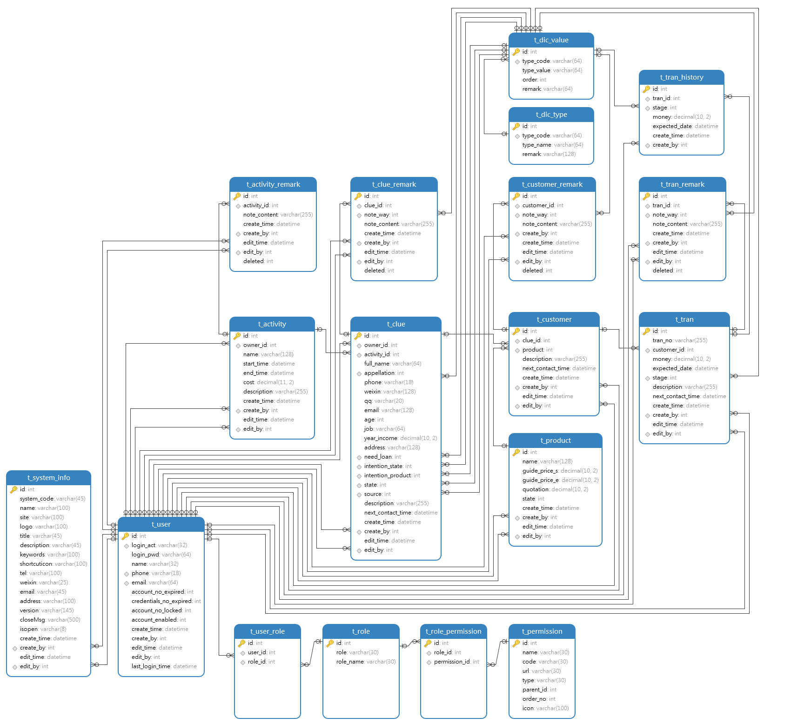

# CRM 项目实战练习

## 简介

本项目基于 https://www.bilibili.com/video/BV1Fi4y1W7NZ/ 视频中提供的资源以及思路进行重做以及部分增强

项目采用前后端分离技术
- 前端主要使用 Vue 框架进行开发
- 后端使用 Spring Boot + MyBatis 完成主要功能的开发
- 使用 Spring Security 进行项目的权限控制
- 数据库使用 MySql + Redis

## 数据库ER图



## 前端项目

采用 Vue 作为主要技术开发

目录结构

```
|- crm-front                     -- 项目根目录
   |- node_modules               -- js 依赖包
   |- public                     -- 公共静态资源
   |- src                        -- 源码文件
   |  |- assets                  -- 页面资源
   |  |- components              -- Vue 组件
   |  |  |- login                -- 登录相关组件
   |  |  |  |- LoginView.vue     -- 登录页面组件
   |  |  |- CrmRoot.vue          -- CRM 项目根组件
   |  |- http
   |  |  |- httpRequestUtils.js  -- 封装发送 AJAX 请求的代码，使用 axios 库
   |  |- router
   |  |  |- index.js             -- 路由配置信息
   |  |- utils
   |  |  |- utils.js             -- 部分公共代码
   |  |- App.vue                 -- Vue 根组件
   |- index.html                 -- 项目首页，访问入口
   |- package.json               -- 项目依赖库配置，包括启动、构建命令
   |- vite.config.js             -- vite 配置文件
```
## 后端项目

基于 Spring Boot 进行创建
使用 MyBatis 完成对 MySql 数据库的操作
使用 Spring Security 完成用户访问权限管理

目录结构

```
|- crm-server
   |- main
   |  |- java
   |  |  |- pers.john.crm
   |  |  |  |- config                                 -- 用于存放配置信息
   |  |  |  |  |- handler.impl                        -- 需要使用到的处理器接口实现类
   |  |  |  |  |  |- AuthenticationFailureHandlerImpl -- 认证失败处理器实现类，用于处理认证失败后的响应结果
   |  |  |  |  |  |- AuthenticationSuccessHandlerImpl -- 认证成功处理器实现类，用于处理认证成功后的响应结果
   |  |  |  |  |- SecurityConfig.class                -- 安全配置类
   |  |  |  |- manager
   |  |  |  |- mapper
   |  |  |  |  |- 对应表的 Mapper 接口，采用全注解方式，接口较多在此不再一一列举
   |  |  |  |- model
   |  |  |  |  |- po
   |  |  |  |  |  |- 对应表的 PO 类，直接对应数据库结构，类较多在此不再一一列举
   |  |  |  |  |- vo
   |  |  |  |     |- HttpResult.class      -- 用于封装响应结果
   |  |  |  |     |- HttpResultCode.class  -- 响应结果的枚举，用于快速构建响应信息
   |  |  |  |     |- SecurityUser.class    -- 安全用户类，对应 PO 中的 User 类，对 User 进行了信息筛选
   |  |  |  |- query
   |  |  |  |- service                     -- 业务包
   |  |  |  |  |- impl                     -- 业务实现类
   |  |  |  |  |  |- UserServiceImpl.class -- 用户业务实现类
   |  |  |  |  |- UserService.class        -- 用户业务接口
   |  |  |  |- utils
   |  |  |  |  |- HttpResponseUtils.class  -- 用于向前端响应数据的工具类
   |  |  |  |  |- JsonUtils.class          -- 用于序列化 JSON 的工具类
   |  |  |  |- web.controller
   |  |  |- Application.clss               -- 主启动类，整个程序的入口
   |  |- resources
   |     |- application.yml                -- Spring Boot 配置文件
   |- test
      |- java
      |  |- pers.johns.crm
      |     |- mapper
      |        |- 测试 Mapper 接口的测试类，用于测试 Mapper 接口是否工作正常
      |- resources
```